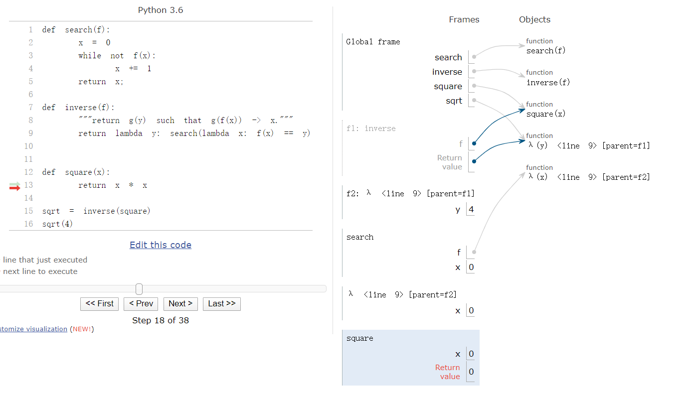

### 1. 背景

最近在看 `cs61a` 的课程，其实目前来说还是比较简单的，毕竟有一定的 `Python`基础。今天看到的这一集看到了个人认为非常厉害的一段code， 特此记录一下


### 2. Code

```python
def search(f):
    x = 0
    while not f(x):
        x += 1
    return x;

def inverse(f):
    """return g(y) such that g(f(x)) -> x."""
    return lambda y: search(lambda x: f(x) == y)
    

def square(x):
    return x * x
    
sqrt = inverse(square)
sqrt(4)
```


### 3. 分析

利用 `search` 函数和 `inverse`函数实现了求反函数的功能。

这里借助课程中学到的一个工具, [链接在这里](http://pythontutor.com/visualize.html#mode=edit)

由于本人理解表达能力有限，大家在上面一步一步运行应该就能明白。

贴一张图

